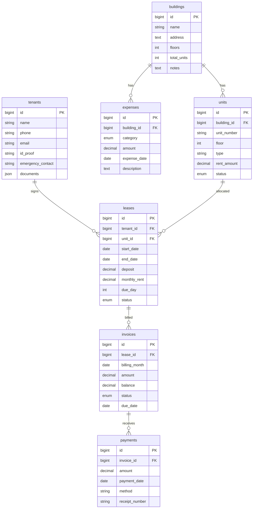

# ERD / Schema Design

```mermaid
erDiagram
    buildings ||--o{ units : has
    buildings ||--o{ expenses : has
    tenants ||--o{ leases : signs
    units ||--o{ leases : allocated
    leases ||--o{ invoices : billed
    invoices ||--o{ payments : receives

    buildings {
      bigint id PK
      string name
      text address
      int floors
      int total_units
      text notes
    }
    units {
      bigint id PK
      bigint building_id FK
      string unit_number
      int floor
      string type
      decimal rent_amount
      enum status
    }
    tenants {
      bigint id PK
      string name
      string phone
      string email
      string id_proof
      string emergency_contact
      json documents
    }
    leases {
      bigint id PK
      bigint tenant_id FK
      bigint unit_id FK
      date start_date
      date end_date
      decimal deposit
      decimal monthly_rent
      int due_day
      enum status
    }
    invoices {
      bigint id PK
      bigint lease_id FK
      date billing_month
      decimal amount
      decimal balance
      enum status
      date due_date
    }
    payments {
      bigint id PK
      bigint invoice_id FK
      decimal amount
      date payment_date
      string method
      string receipt_number
    }
    expenses {
      bigint id PK
      bigint building_id FK
      enum category
      decimal amount
      date expense_date
      text description
    }
```
